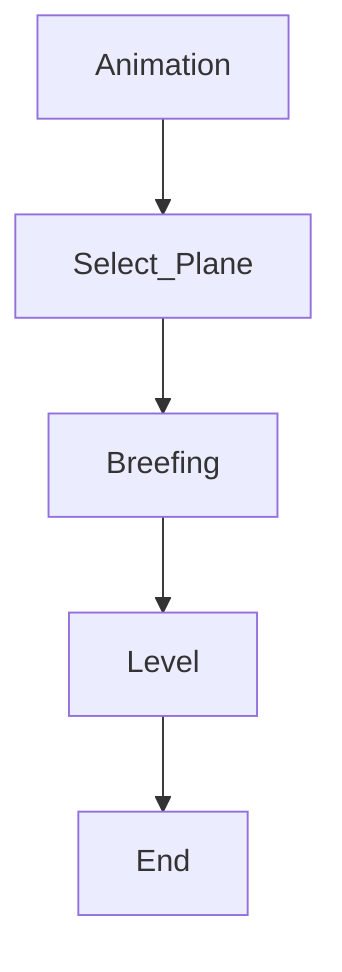

Project skies

Project Skies is a “Fighter plane sim-cade videogame” oriented in mixing experiences like “Ace Combat” with “DCS” or “Tiny Combat Arena”.

The main focus is to give “semi-simplified physics” to take the flight experience to the next level while giving elements like a story, cinematics and other “videogame specific components”.

This videogame is made on the “Pankarta Software” game engine (on development) coded in Rust and using elements like:

- WGPU: For graphics rendering.
- SDL2: For window management.
- Rapier: For physics calculation.

These tools are the main focus of the engine and what make the development experience what it is.

By itself the videogame is mainly focused on following a “main game loop” pretty similar to the “Ace Combat Series” one, this being.



This for each level.

---

## Gameplay

The gameplay elements of the game are defined by the different actions the player can perform, being these:

1. The player should be able to select his aircraft and weaponry.
2. The player should be able to land and take off.
3. The player should be able to power up and down.
4. The player should be able to rotate on each axis by moving the ailerons, elevators or rudders.
5. The player should be able to open and close the landing gear, this changing the air acceleration.
6. The player should be able to rotate the camera manually by:
    1. Mouse movement: the player should be able to move the camera with the mouse, with a “center” button, this also adds the need of moving the camera with a Head-Tracker.
    2. Stick movement: if the player have an analog stick the camera movement should imitate the “Ace Combat Series” camera movement style.
7. The player should be able of having a display of information of the flight, this includes:
    1. Altitude.
    2. Speed.
    3. Bearing.
    4. Horizon line.
    5. More…
8. The player will have the ability of selecting “targets”.
9. If the player have a target selected, it will be able to lock the vision direction towards that target.
10. The player will have the ability of activating a Air to Air mode that will let him:
    1. Lock air targets.
    2. Launch guided missiles to other aircraft (Fox-1, Fox-2, Fox-3).
    3. Shoot bullets with a “specific selected target point for moving objectives”.
11. The player will have the ability of activating a Air to Ground mode that will let him:
    1. Lock ground targets.
    2. Launch unguided and guided missiles for ground targets.
    3. Launch guided and unguided bombs.
    4. Shoot bullets with a “specific selected target point for moving objectives”.

This are the main mechanics of the plane and the player should be able of doing all of them for completing their missions.

Also there are some requirements for other elements that surround the player itself, elements like:

1. Adding ground targets like:
    1. Light and heavy vehicles.
    2. Bases.
    3. Anti-air sites.
    4. More…
2. Adding air targets like:
    1. Fighter planes.
    2. Attack planes.
    3. Awacs planes.
    4. Helicopters.
    5. Intercontinental missiles.
    6. More.

All these with specific logic and behavior.

---

## Physics

The latest iteration of the game haves “Physics” for emulating the behavior of the plane, compared to the past iterations that used direct modifications to a transform for that.

This “physics simulation” works  thanks to the implementation of “Rapier” as the main physics engine of the game.

Thanks to this we have lots of physics components to take account on, some of them are:

### Physics components:

1. RigidBody: A rigidbody is a component that is affected by the physics system, being these dynamic or static, meaning that constantly gets affected by forces like gravity or is something like a static object who can move by changing his “translation” directly.
2. Collider: A space who can be settled manually or based on a specific shape, that let us interact with other shapes on contact, either by the use of triggers or by colliding with them.

### Definition of colliders

When setting colliders we have different ways of doing it, being mainly:

1. Shape based: We add shapes for example boxes in respective positions, and then use them to test collision, useful for performance.
2. Mesh based: We automatically create a collider based on the mesh of the player, making it 1 to 1 on the way the object looks, useful for accuracy.

---

### Collision Generation

An important element of the Physics calculations is the generation of correct colliders, Rapier haves different ways of generating colliders for each object but the main ways to take account on are these:

```rust
// for cuboid shaped collider
let _ = ColliderBuilder::cuboid(1.0, 1.0, 1.0).build();

// for ball shaped collider
let _ = ColliderBuilder::ball(0.5).build();

// for capsule shaped colliders (we set the main angle with _x, _y or _z)
let _ = ColliderBuilder::capsule_y(0.5, 0.2).build();

/*
	Heightfield colliders are used to simulate a "ground collider".
	
	setting planes with altitude variances and connecting them making a quick
	and optimized terrain collider.
*/
let _ = ColliderBuilder::heightfield(heights, scale);

// for trimesh collider
let _ = ColliderBuilder::trimesh(vertices, indices);

// when building a collider we can define more values from it like:
let collider = ColliderBuilder::new(SharedShape::ball(0.5))

    // The collider translation wrt. the body it is attached to.
    // Default: the zero vector.
    .translation(vector![1.0, 2.0, 3.0])
    
    // The collider rotation wrt. the body it is attached to.
    // Default: the identity rotation.
    .rotation(vector![0.0, PI, 0.0])
    
    // The collider position wrt. the body it is attached to.
    // Default: the identity isometry.
    .position(Isometry::new(vector![1.0, 2.0, 3.0], vector![0.0, PI, 0.0]))
    
    // The collider density. If non-zero the collider's mass and angular inertia will be added
    // to the inertial properties of the body it is attached to.
    // Default: 1.0
    .density(1.3)
    
    // The friction coefficient of this collider.
    // Default: ColliderBuilder::default_friction() == 0.5
    .friction(0.8)
    
    // Whether this collider is a sensor.
    // Default: false
    .sensor(true)
    
    // All done, actually build the collider.
    .build();
```

With this done we can specifically define what and how our colliders will look like and affect our world.

---

### Dynamics Calculation

For the correct simulation of the plane we need to take on account certain things, specially the 4 main forces who act on the actual position of the plane itself.


This 4 forces are:

1. Thrust: The directional force that represents the “forward movement” of the plane, thanks to the propeller, turbine or way of accelerating, if its more than the drag force the plane goes forward.
2. Lift: The directional force that represents the “altitude gaining or maintaining“ based directly on thrust, angle of attack and other values, if its more than the gravity force the plane goes up.
3. Gravity: The natural attraction of the object to the ground.
4. Drag: The natural deceleration by friction with the air, totally dependent on how good is the aerodynamics of the plane.

This forces are gonna be directly simulated by physics calculations and are gonna be the main way of moving in the game.

There are 2 different ways of applying this forces, this are:

1. General Application: We get 1 value of lift and drag to apply it directly on the plane generally, this makes a “simpler” method of emulating lift and drag but its less realistic.
2. Surface Based Application: We get a value of lift and drag for each aero surface on the plane, so the wings, elevators, and rudders will simulate the lift and drag of each depending on elements like Lift and Drag Coefficients, applying direct forces in form of a torsion instead of a torsion based on the same center of mass and other information already simulated in sites like: [Airfoiltools.com](http://Airfoiltools.com); all this to make a better simulation of the dynamics of the aircraft.

---

### Calculations

To set this calculations we are gonna need to know this equations:

---

1. Drag
    
    We calculate the drag to slow down our objects, directly stopping it from having infinite acceleration by hitting the air:
    
    $$
    Drag = 1/2 * Cd * A * p * V^2
    $$
    
    Where:
    
    - Cd: Drag coefficient.
    - A: Frontal area of the aircraft (ignored for simulation).
    - p: Air density (ignored for simulation).
    - V: Speed of the aircraft in m/s.
    
    ---
    
2. Lift
    
    We calculate the lift as the ability of the plane to gain altitude by speed and angle of attack:
    
    $$
     Lift = 1/2 * p * V^2 * S * Cl
    $$
    
    Where:
    
    - p: Air density (ignored for simulation).
    - V: Speed of the aircraft in m/s.
    - S: Wing area in m^2.
    - Cl: Lift coefficient (value that varies based on the angle of attack and wing shape).

---

For the calculations we use lift and drag coefficients, this data is fully depending on the type of airfoil the surface is and the angle of attack from that airfoil.

The way we will sample that information is by getting the angle of attack of the respective air foil, for example.

We will get a base of data from [this page](http://airfoiltools.com/polar/details?polar=xf-naca64206-il-50000), there we will get a list of data, where that data is equal to values like this one:

| Alpha (Angle of attack) | Lift Coefficient | Drag Coefficient |
| --- | --- | --- |
| 6.500 | 0.5065 | 0.05769 |
| 6.750 | 0.5315 | 0.05853 |
| 7.000 | 0.5784 | 0.05824 |
| 7.250 | 0.6545 | 0.05685 |
| 7.500 | 0.6941 | 0.05501 |
| 7.750 | 0.6028 | 0.05867 |
| 8.000 | 0.8742 | 0.03612 |
| 8.250 | 0.9176 | 0.03088 |
| 8.500 | 0.9176 | 0.03106 |
| 8.750 | 0.9170 | 0.03303 |

Based on the information we obtained (in this case from the **NACA 64-206** which **is similar or close to the F-16 wing ones**), we get the angle of attack (angle between the planes velocity vector and the angular velocity where the wing is facing) and based on that value we will get the **lift coefficient(Cl)** and **drag coefficient(Cd)**.

In this example when the angle of attack of a wing is 8.25 the lift coefficient will be **0.9176**, while the drag coefficient is **0.03088.**


This sampling will be done by an algorithm similar to this one:

```rust
/// # Sample
///
/// This function will recieve alpha (angle of attack of wing), will make a search
/// through the data on the table (early mentioned) and will return the CD and CL
///
/// ## Parameters
/// - Alpha: Angle of attack of surface.
///
/// ## Returns
/// - CD Drag Coefficient.
/// - CL Lift Coefficient.
pub fn sample(&self, alpha: f32) -> (f32, f32) {
		// Get the scaled index and clamp it within bounds
		let scaled_index = self.alpha_to_index(alpha);
		let clamped_index = scaled_index.clamp(0, self.data.len() - 1);
		
		// Access and return Cl and Cd values from data
		let data_point = &self.data[clamped_index];
		(data_point.y, data_point.z)
}

/// # Alpha to index
///
/// This function will recieve our alpha (AoA) and from it it will get an  
/// index inside our airfoil data.
/// Then that index will be returned to search data related to it.
///
/// ## Parameters
/// - Alpha: Angle of attack of surface.
///
/// ## Returns
/// - Scaled Index: Index of the airfoil data that contains his respective CD and CL
fn alpha_to_index(&self, alpha: f32) -> usize {
		// we get the range between the maximum alpha on the data and the minimum
		let range: f32 = self.max_alpha - self.min_alpha;
		
		// when the max_alpha and the min_alpha has the same numerical value
		if range == 0.0 {
		    return 0;
		}
		
		// scale the data to get an index for the values in the airfoil data
		let normalized_alpha = (alpha - self.min_alpha) / range;
		let scaled_index = (normalized_alpha * (self.data.len() as f32 - 1.0)).round();
		scaled_index as usize
}
```

With this script we will be able to pass the angle of attack from our wings and then directly apply a force to a specific point of the wing, generating the torque that will let our plane rotate in that direction.

---

## Level Planning

Each level will have a file with a “planning” for the level, this file will be mainly setted for timed activated actions, for example, if at the start of the level we set a dialog to be played it will be played, if we set a animation to be played it will be, etc…

This way we can define in which moment of the mission we can show certain elements for the story telling.

This files will look something like this:

```python
EventSystem (
    event_list: {
        1000: Event (
            event_type: PlayAudio(
                AudioFile(
                    file_name: "./assets/audio/ReasonToFight"
                )
            ),
        ),
        
        5000: Event (
            event_type: PlayAnimation(
                AnimationFile(
                    file_name: "./assets/animations/TestAnimation"
                )
            ),
        )
    }
)
```

The number at the start represents the time in seconds for the action to be actionable, if the level timer is higher than that, it will play once.

Each audio has the structure of:

1. File Name
    1. song.ogg
    2. subtitles.ron

The main reason for this is so we can call directly the folder of the song, and then just execute the needed subtitle call, and talking about that, for adding subtitles to a audio, the subtitles.ron file should have this structure:

```python
SubtitleData(
    subtitles: {
    3000: "Pixy: So, have you found a reason to fight yet?",
    7000: "Budy.",
    },
)
```
